<div align="center">


# FITTRACK

### Gym management, without the spreadsheet.

A production-grade admin dashboard for running a gym — members, memberships,
attendance, trainers and payments — built as a single-page React application
with a hand-authored design system and zero UI dependencies.

<br/>

[](https://github.com/Ahmadhsn1/fittrack-gym-management/actions/workflows/ci.yml)
[](LICENSE)
[](https://react.dev)
[](https://vite.dev)
[](#-performance)
[](#-performance)

<br/>

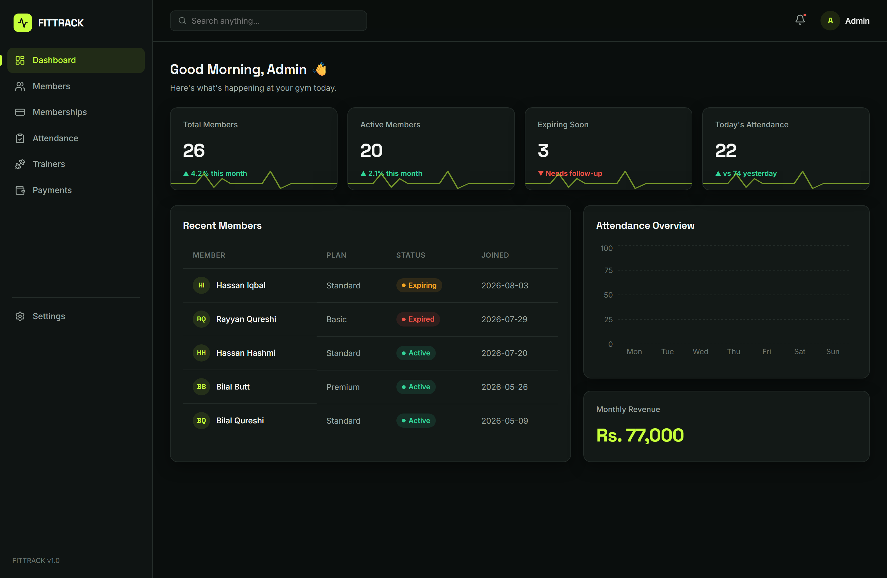

<sub><b>The dashboard.</b> Live KPIs, weekly attendance, revenue roll-up — all derived, none hardcoded.</sub>

</div>

<br/>

---

## Contents

- [Why this exists](#why-this-exists)
- [Feature tour](#-feature-tour)
- [Screenshots](#-screenshots)
- [Tech stack](#-tech-stack)
- [Architecture](#-architecture)
- [Design system](#-design-system)
- [Getting started](#-getting-started)
- [Performance](#-performance)
- [Accessibility & responsiveness](#-accessibility--responsiveness)
- [Project status & roadmap](#-project-status--roadmap)
- [Contributing](#-contributing)
- [License](#-license)

---

## Why this exists

Most gyms in Pakistan still run on a paper register and a WhatsApp group. The
owner knows roughly how many members they have, has no idea which memberships
lapse next week, and reconstructs the month's revenue from a stack of receipts.

FitTrack is the interface for that problem: **one screen that answers "how is my
gym doing right now?"**, and five more that let you act on the answer without
ever touching a spreadsheet.

It is also, deliberately, a study in building a polished product surface *without*
reaching for a component library. Every table, modal, badge, empty state and
theme in this repo is authored from scratch on top of a CSS custom-property
token layer — because knowing how a design system works matters more than knowing
how to import one.

> [!NOTE]
> **Scope, stated honestly.** FitTrack is a **complete front-end** running on an
> in-memory data layer seeded with realistic fixtures (26 members, 26 payment
> records, 5 trainers, 3 plans). Every interaction is real — create, edit,
> delete, search, filter and theme all work — but state resets on reload because
> there is no server yet. The data layer is deliberately isolated behind React
> Context so that swapping fixtures for a REST or Supabase backend is a
> provider-level change, not a rewrite. See [Roadmap](#-project-status--roadmap).

---

## ✦ Feature tour

### Dashboard — the answer screen

Nothing on the dashboard is a static number. Every tile is computed from the live
data layer on each render, so the moment you add a member or record a payment,
the KPIs move.

| Tile | Derivation |
| :--- | :--- |
| **Total members** | `members.length` |
| **Active members** | members filtered on `status === 'Active'` |
| **Expiring soon** | members flagged `Expiring`, surfaced for follow-up |
| **Today's attendance** | present count off today's roster |
| **Monthly revenue** | sum of `Paid` payments, currency-formatted |

Alongside them: a **Recharts** bar chart of the week's footfall wired to the same
CSS variables as the rest of the app (so it re-themes with everything else), and
a *Recent Members* table sorted by join date.

### Members — the workhorse

- **Full CRUD** — add, edit and remove members through a validated modal form.
- **Compound filtering** — free-text search across *name and phone* composed with
  a status filter and a plan filter. All three narrow simultaneously and the
  result set is `useMemo`-memoised against its inputs.
- **Row drill-through** — click any row for the member's detail view, with
  `stopPropagation` on the action cell so Edit/Delete never trigger navigation.
- **Destructive-action guard** — deletes route through a confirmation dialog that
  names the member being removed. No accidental data loss.
- **Real empty states** — filtering to zero results produces a designed empty
  state, not a blank table.

### Member details — the 360° view

A dynamic route (`/members/:id`) that joins across the data layer: personal
information, membership window, attendance split (present vs absent), and the
member's full payment history pulled from the payments store by `memberId`.
Unknown IDs render a graceful not-found state instead of crashing.

### Memberships — plans as first-class objects

Plans are editable entities, not enum strings. Each plan card shows price,
duration and feature list, plus a **live count of members currently on that
plan** computed by cross-referencing the members store. The third tier is
highlighted as *Most Popular* with an accent ring.

### Attendance — daily roster

Per-member present/absent toggle with an optimistic local update, a date picker,
searchable roster, and Present/Absent totals that recount on every toggle.

### Trainers — staff directory

Card grid with specialty, rating, availability, experience and assigned member
count. Full CRUD plus a detail modal.

### Payments — the money

Ledger with per-row CRUD, status filtering (`Paid` / `Pending` / `Failed`), and a
header that keeps a running **collected vs pending** total in locale-formatted
currency.

### Settings — profile & appearance

Admin profile form with save-confirmation feedback, and a **dark/light theme
switch** that flips the entire application — including chart axes, grid lines and
tooltips — by swapping one `data-theme` attribute on `<html>`.

---

## ✦ Screenshots

<table>
  <tr>
    <td width="50%">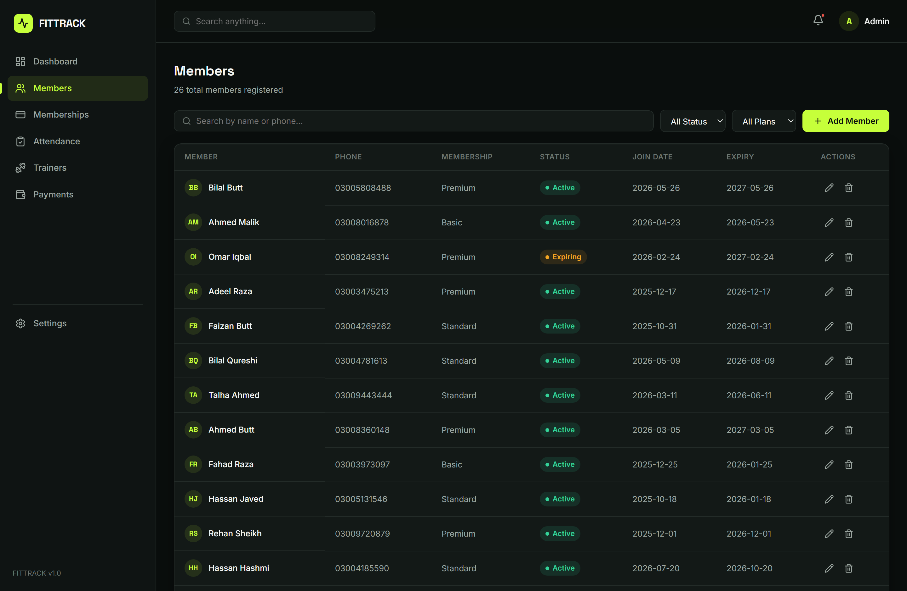</td>
    <td width="50%">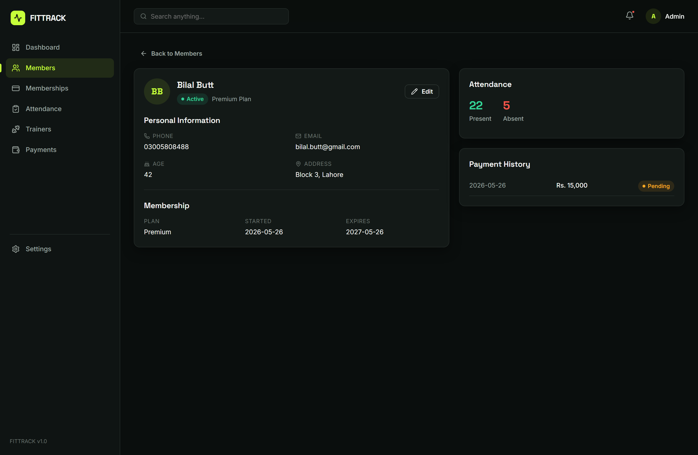</td>
  </tr>
  <tr>
    <td><b>Members</b> — search, status filter, plan filter, per-row actions</td>
    <td><b>Member details</b> — joined view with payment history</td>
  </tr>
  <tr>
    <td>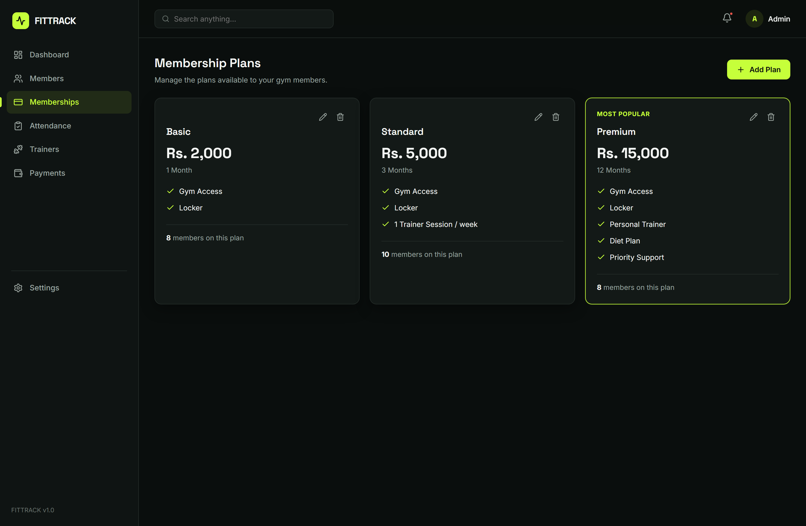</td>
    <td>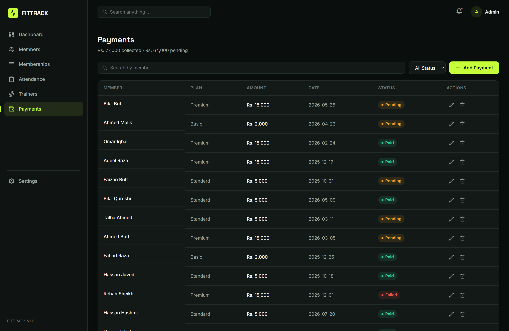</td>
  </tr>
  <tr>
    <td><b>Memberships</b> — editable plans with live member counts</td>
    <td><b>Payments</b> — ledger with collected vs pending totals</td>
  </tr>
  <tr>
    <td>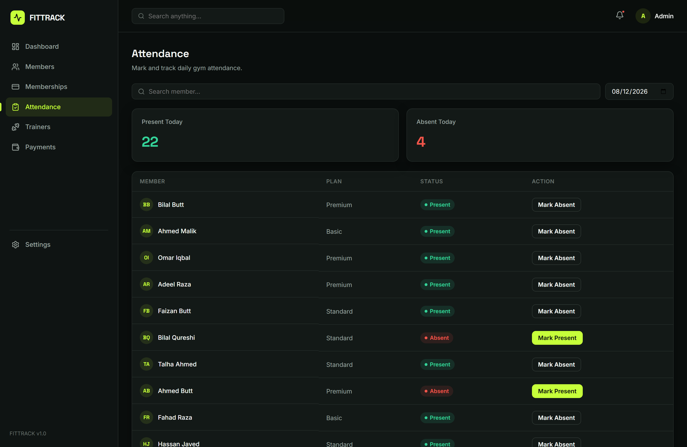</td>
    <td>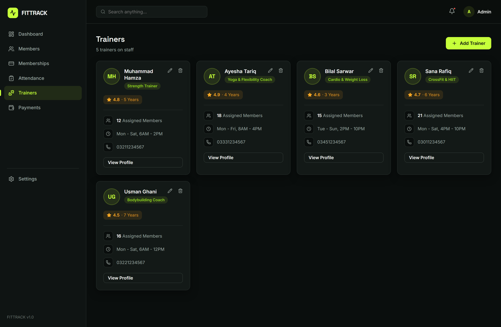</td>
  </tr>
  <tr>
    <td><b>Attendance</b> — daily roster with present/absent toggle</td>
    <td><b>Trainers</b> — staff directory with detail modal</td>
  </tr>
</table>

### Light theme

The same token layer, re-pointed. One attribute swap, zero component changes.

<table>
  <tr>
    <td width="50%">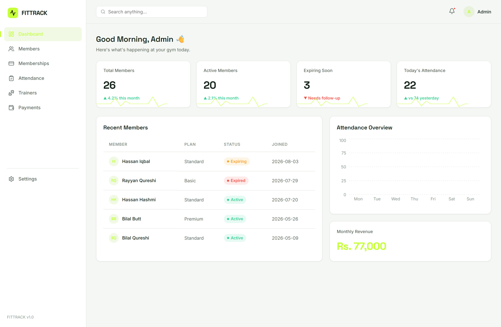</td>
    <td width="50%">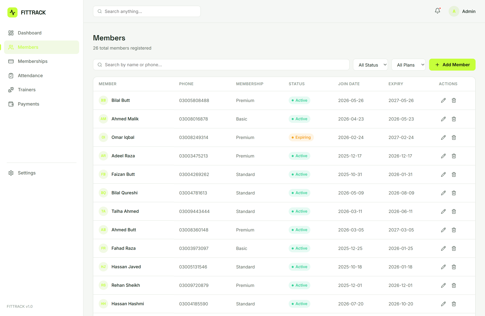</td>
  </tr>
  <tr>
    <td colspan="2">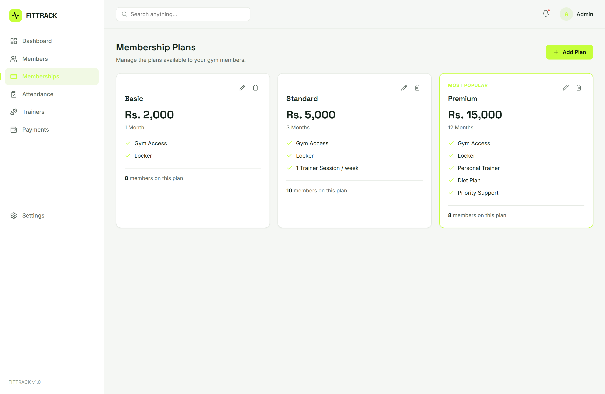</td>
  </tr>
</table>

Note that semantic status colours hold constant across both themes — `--success`
stays the same green in each, because "paid" should not change meaning with
ambient light. Only surfaces, borders, text and shadows re-point.

### Mobile

Below `860px` the sidebar becomes an off-canvas drawer with a tappable backdrop;
stat grids collapse to a single column and tables scroll horizontally inside
their card rather than breaking the layout.

<div align="center">
  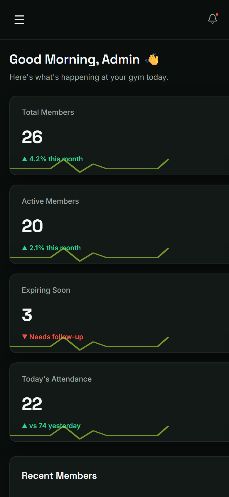
  &nbsp;&nbsp;&nbsp;
  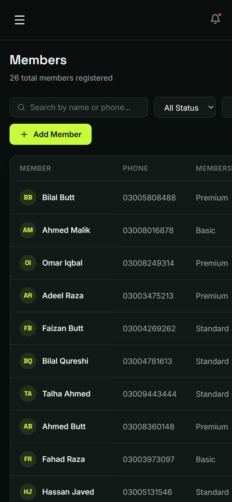
</div>

---

## ✦ Tech stack

| Layer | Choice | Why |
| :--- | :--- | :--- |
| **UI** | React 19.2 | Latest stable; `StrictMode` on in development to surface effect bugs early |
| **Build** | Vite 8.2 | Rolldown-based bundler; instant HMR in development |
| **Routing** | React Router 7 | Nested routes plus a dynamic `/members/:id` segment |
| **Charts** | Recharts 3 | Composable SVG charts that accept CSS variables, so they theme for free |
| **Icons** | lucide-react | Tree-shakeable, single visual language, consistent stroke weight |
| **Styling** | Hand-authored CSS | Four-layer cascade over a custom-property token system — no Tailwind, no MUI |
| **State** | React Context + hooks | Four scoped providers; no Redux for a problem this size |
| **Linting** | oxlint | Rust-based, runs the full tree in milliseconds, enforces rules-of-hooks |
| **CI** | GitHub Actions | Lint and production build on every push and pull request |

**Zero UI dependencies.** No component library. Every table, modal, badge, form
control, empty state, avatar and dialog in these screenshots is authored in this
repository.

---

## ✦ Architecture

```
fittrack/
├── .github/
│   ├── ISSUE_TEMPLATE/          # Structured bug + feature intake
│   └── workflows/ci.yml         # Lint + build on push and PR
├── docs/
│   ├── ARCHITECTURE.md          # Deeper technical write-up
│   └── screenshots/             # Assets referenced by this README
├── public/
│   └── favicon.svg              # Brand mark
└── src/
    ├── components/              # 11 presentational + composite components
    │   ├── Modal.jsx            #   ↳ generic shell every dialog composes
    │   ├── ConfirmDialog.jsx    #   ↳ destructive-action guard
    │   ├── AddMemberModal.jsx   #   ↳ doubles as the edit form via initialData
    │   ├── EditPaymentModal.jsx
    │   ├── EditPlanModal.jsx
    │   ├── EditTrainerModal.jsx
    │   ├── Sidebar.jsx          #   ↳ data-driven nav, collapses to a drawer
    │   ├── Topbar.jsx
    │   ├── StatCard.jsx
    │   ├── TrainerCard.jsx
    │   ├── Badge.jsx            #   ↳ single source of truth for status colour
    │   └── EmptyState.jsx
    ├── context/                 # The data layer — swap this, not the UI
    │   ├── MembersContext.jsx
    │   ├── PaymentsContext.jsx
    │   ├── MembershipsContext.jsx
    │   └── ThemeContext.jsx
    ├── data/                    # Seed fixtures (realistic, not lorem ipsum)
    ├── pages/                   # 8 route-level views
    └── styles/                  # tokens → base → layout → components
```

### Three decisions worth explaining

**1. Context per domain, not one global store.**
`MembersContext`, `PaymentsContext`, `MembershipsContext` and `ThemeContext` are
separate providers. A theme toggle does not re-render the payments table, and
each store exposes a narrow, intention-named API — `addMember`, `updateMember`,
`deleteMember` — rather than leaking a setter. Every consumer hook throws a
descriptive error when used outside its provider:

```jsx
export function useMembers() {
  const ctx = useContext(MembersContext);
  if (!ctx) throw new Error('useMembers must be used within MembersProvider');
  return ctx;
}
```

That turns an entire class of silent `undefined` bugs into an immediate, named
failure at the call site.

**2. The data layer is a seam, not a foundation.**
Pages never import from `src/data/`. They consume context hooks. The fixtures are
wired in exactly once, inside each provider's `useState` initialiser — so
replacing them with `fetch`, TanStack Query or a Supabase client means editing
four provider files while every page, table and modal stays untouched. The
in-memory store is a placeholder standing in the right shape.

**3. One modal shell, many forms.**
`Modal.jsx` owns the overlay, the click-outside dismissal (guarded on
`e.target === e.currentTarget`, so a drag that ends outside the box does not close
it) and the labelled close affordance. `ConfirmDialog` and all four entity forms
compose it. `AddMemberModal` serves both create and edit paths by branching on an
optional `initialData` prop — one component, one validation surface, two flows, no
duplication. That validation includes a **cross-field date rule**: expiry must
fall after start, enforced both by a `min` attribute on the input and by a guard
in the submit handler that renders an inline error.

Full write-up: **[docs/ARCHITECTURE.md](docs/ARCHITECTURE.md)**

---

## ✦ Design system

No Tailwind, no MUI. A four-layer CSS cascade over ~40 custom properties.

| Layer | File | Responsibility |
| :--- | :--- | :--- |
| **Tokens** | `styles/tokens.css` | Every colour, font, radius, shadow and layout constant. Both themes. |
| **Base** | `styles/base.css` | Reset, typography scale, focus rings, `prefers-reduced-motion` |
| **Layout** | `styles/layout.css` | App shell, sidebar, topbar, responsive breakpoints |
| **Components** | `styles/components.css` | Cards, tables, buttons, badges, forms, modals |

### Palette

The brand accent is a single high-energy lime. Status colours are held
deliberately distinct from it, so "active" never reads as "branded".

| Token | Dark | Light | Role |
| :--- | :--- | :--- | :--- |
| `--accent` | `#C6FF3A` | `#C6FF3A` | Brand, primary actions, chart fills |
| `--bg` | `#0A0E0D` | `#F5F7F4` | App canvas |
| `--card` | `#131917` | `#FFFFFF` | Elevated surfaces |
| `--border` | `#232B28` | `#E4E9E2` | Hairlines |
| `--text-primary` | `#F5F7F5` | `#14231A` | Headings, table primary cells |
| `--text-secondary` | `#9CA6A1` | `#5B6960` | Supporting copy |
| `--success` | `#34D399` | `#34D399` | Active, present, paid |
| `--warning` | `#F5A623` | `#F5A623` | Expiring, pending |
| `--danger` | `#F0554A` | `#F0554A` | Expired, failed, destructive |

### Type

`Space Grotesk` for display, headings and KPI numerics — a geometric face that
gives large figures more presence than the body stack. `Inter` for body and UI
copy. Both preconnected and `display=swap`'d so text paints immediately.

### Theming in one attribute

```css
:root                      { --bg: #0A0E0D; --card: #131917; /* … */ }
html[data-theme="light"]   { --bg: #F5F7F4; --card: #FFFFFF; /* … */ }
```

`ThemeContext` sets `data-theme` on `document.documentElement`. Because Recharts
receives `stroke="var(--border)"` and `fill="var(--accent)"` rather than literals,
**the charts re-theme along with the DOM** — no JS chart-config branching, no
duplicate palettes.

---

## ✦ Getting started

### Prerequisites

- **Node.js 20.19+** (Vite 8 requirement; developed on 24.19)
- npm 10+

### Install and run

```bash
git clone https://github.com/Ahmadhsn1/fittrack-gym-management.git
cd fittrack-gym-management
npm install
npm run dev
```

Vite prints a local URL — open it and the dashboard loads with seeded data. No
`.env`, no database, no external services required.

### Scripts

| Command | Does |
| :--- | :--- |
| `npm run dev` | Dev server with HMR |
| `npm run build` | Production build to `dist/` |
| `npm run preview` | Serve the built output locally |
| `npm run lint` | oxlint across the source tree |

### Deploying

Static output — any host works.

```bash
npm run build     # → dist/
```

One caveat worth knowing: the app uses `BrowserRouter`, so the host must rewrite
unknown paths to `index.html` or a hard refresh on `/members` will 404. Vercel
and Netlify do this by default for SPAs; Nginx needs
`try_files $uri /index.html;`.

---

## ✦ Performance

Measured on the production build in this repository:

```
dist/index.html                   0.97 kB │ gzip:   0.52 kB
dist/assets/index-*.css          13.65 kB │ gzip:   3.43 kB
dist/assets/index-*.js          648.26 kB │ gzip: 190.21 kB
```

**194 kB gzipped total** across all three assets — one round trip on any
reasonable connection.

**3.43 kB of gzipped CSS** covers the entire application — two complete themes,
every component, every breakpoint. That is what authoring against a token layer
buys you instead of shipping a utility framework.

The JS figure is dominated by Recharts' SVG primitives and React DOM. It is a
single chunk today because the app is a single eager bundle; route-level
`React.lazy` + `Suspense` is the tracked next step (see roadmap) and moves the
chart library off the critical path.

**Render discipline:** every filtered list is `useMemo`-memoised against its
inputs, so typing in a search box recomputes one derived array rather than
re-filtering on every keystroke of every row.

---

## ✦ Accessibility & responsiveness

What is in place:

- **Icon-only controls carry `aria-label`** — every edit, delete, close and menu
  button announces its purpose rather than reading as "button".
- **Focus is visible by design** — `:focus-visible` gets a 2 px accent outline with
  offset, applied globally. Focus rings are styled, never stripped.
- **Motion respects the OS** — a global `@media (prefers-reduced-motion: reduce)`
  block collapses every transition and animation for users who ask for it.
- **Status is never colour-alone** — each badge pairs its hue with a text label, so
  *Expiring* is legible to a colour-blind user and to a screen reader.
- **Semantic tables** — real `<table>` / `<thead>` / `<tbody>` markup, not a grid of
  divs, so row and column relationships survive assistive tech.
- **Native constraint validation** — `required`, `type="email"`, `type="number"`
  with `min`/`max`, and `type="date"` with a dynamic `min`, layered under the
  JS-side cross-field check.

Responsive behaviour at three breakpoints:

| Breakpoint | Change |
| :--- | :--- |
| `1024px` | Two-column grids and the chart row stack to one column |
| `860px` | Sidebar becomes an off-canvas drawer with a tappable backdrop |
| `560px` | Stat grid drops to a single column; tables condense and scroll in-card |

Verified down to 390 px (iPhone 14 width).

**Tracked gap, stated plainly:** form `<label>` elements are visually associated
but not yet programmatically bound via `htmlFor`/`id`. It is a real
screen-reader shortcoming and it is on the roadmap below rather than papered over
here.

---

## ✦ Project status & roadmap

**v1.0 — shipped.** Eight routes, four data stores, full CRUD across four
entities, two themes, responsive to 390 px, lint and build green in CI.

The front end is complete. What is next is depth behind it:

- [ ] **Persistence** — REST/Supabase behind the existing context seam; the UI
      does not change
- [ ] **Auth** — real admin login, protected routes, session handling
- [ ] **Route-level code splitting** — `React.lazy` per page to get Recharts off
      the initial bundle
- [ ] **Test suite** — Vitest + React Testing Library on the reducers and
      filter logic first, then component smoke tests
- [ ] **Accessibility pass** — bind form labels with `htmlFor`/`id`, add a focus
      trap and `Escape`-to-close to `Modal`, and run an axe audit over every route
- [ ] **Attendance history** — persisted per-day records instead of a single
      in-memory roster, with per-member trend charts
- [ ] **Automated renewal alerts** — surface expiring memberships as actionable
      notifications rather than a KPI tile
- [ ] **Reports** — CSV/PDF export for revenue and attendance
- [ ] **TypeScript migration** — the entity shapes are stable enough to be typed

---

## ✦ Contributing

Contributions are welcome. Please read
**[CONTRIBUTING.md](CONTRIBUTING.md)** for the branch naming, commit
convention and the checks CI runs.

Quick version:

```bash
npm run lint && npm run build   # both must pass before you open a PR
```

Bug reports and feature requests have
[structured templates](.github/ISSUE_TEMPLATE) — using them gets you a faster
response.

---

## ✦ License

[MIT](LICENSE) © Ahmad Hassan

---

<div align="center">

**Ahmad Hassan**

Applied AI engineer — LLM-powered products end to end: RAG, agents, and the
full-stack systems around them.

[](https://github.com/Ahmadhsn1)
[](https://www.linkedin.com/in/ahmadhsn1/)

<sub>If this was useful or interesting, a ⭐ is genuinely appreciated.</sub>

</div>

## Case study

The engineering decisions, metrics and screenshots for FitTrack are written up in the [FitTrack case study](https://ahmadhsn1.github.io/work/fittrack/).
